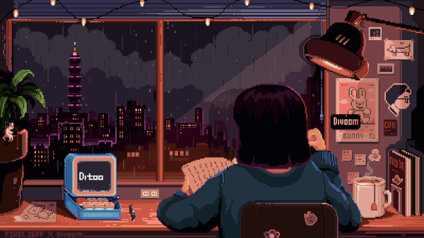

<!-- BANNER IMAGEEEEEEEEEEEEEEEEEEEEEEEEEEEEEEEEEEEEEEEEEEEEEEEEEEEEEEEEEEEEEE -->
[]

<!-- INTRODUCTIONNNNNNNNNNNNNNNNNNNNNNNNNNNNNNNNNNNNNNNNNNNNNNNNNNNNNNNNnnnnnnn-->
<h1 align="center">
    
</h1>

<!-- HEADLINEEEEEEEEEEEEEEEEEEEEEEEEEEEEEEEEEEEEEEEEEEEEEEEEEEEEEEEEEEEEEEEEE -->
<h3 align="center">A passionate front-end developer from Pakistan!</h3>

<!--  -->
<!--  -->

<!--    -->

  

<!-- 

  

-->

- 🔭 I’m currently working on: **Travel Website.**

- 🌱 I’m currently learning: **TypeScript.**

- 🤝 Visit my LinkTree: <a href="https://linktr.ee/KIRAN___SHAMS">LinkTree <a/>

- 👨‍💻 My projects are available at <a href="https://github.com/kiranShamsHere?tab=repositories">GitHub Repositories<a/>

- 💬 Ask me about: JS, PHP, Laravel... or anything [here](https://github.com/kiranShamsHere/kiranShamsHere/issues)

 

<!-- Tech Stack -->

<h2>⚒️ Languages-Frameworks-Tools ⚒️</h2>
    
    
 
 
 

<!-- Snake -->

    
  

<!-- Counter -->

    
  

